# LinkLab · Communication Debugger / 通讯调试台

<p align="center">
  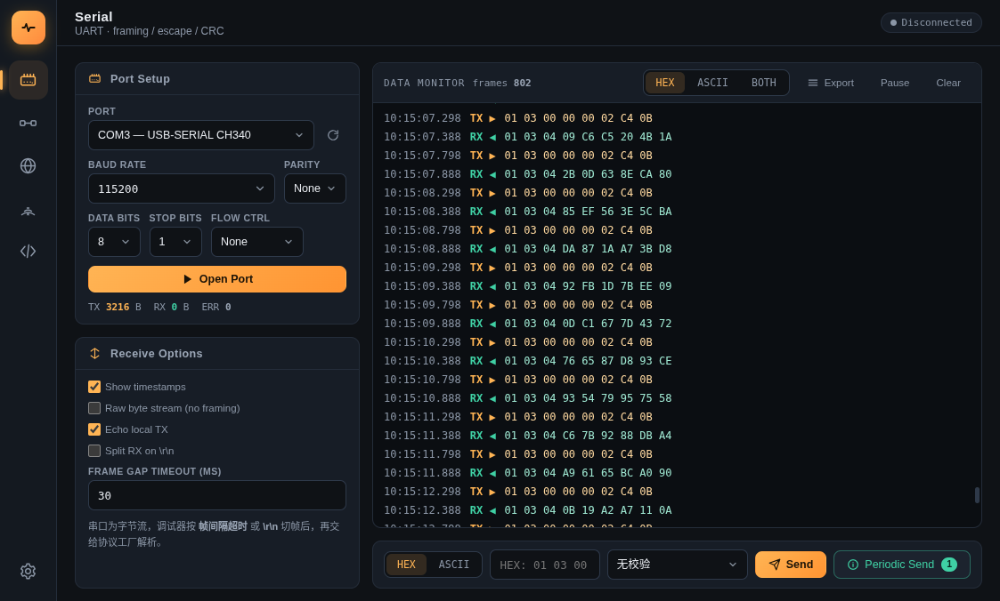
</p>

**[中文说明](#中文-linklab--通讯调试台)**

**LinkLab** is a cross-platform communication debugger for embedded development, covering **Serial UART / CAN bus / TCP-UDP network / MQTT**, with a built-in protocol factory (Modbus, CANopen, DL/T 645, NMEA, etc.) and periodic-send queues.

Rewritten from a single-file HTML prototype into a **React 18 + TypeScript + Tauri 2 (Rust)** desktop app — small binaries, fast startup, low memory. Ships with **dark / light themes** and a **bilingual (中文 / English) UI**.

## Features

| Channel | Capabilities |
|---|---|
| **Serial UART** | Any baud rate (1200 ~ 2000000) + 17 presets, USB hot-plug enumeration, full data/stop/parity/flow control, frame splitting by gap / CRLF / raw stream |
| **CAN bus** | socketCAN (auto-detected can0 / vcan0), standard / extended / RTR frames, hardware ID filtering, CANopen frame parsing |
| **TCP / UDP** | TCP client / TCP server (multi-client) / UDP client / UDP server; the server auto-replies to the latest peer |
| **MQTT** | Publish / subscribe, topic filtering, QoS, JSON demo stream |

**Protocol factory** (bidirectional frame build & parse with real checksum algorithms):
- Modbus RTU (CRC16) · Modbus ASCII (LRC) · Modbus TCP (MBAP)
- CANopen (field-level parsing of NMT / SDO / PDO / EMCY / heartbeat, plus SDO request builder)
- DL/T 645-2007 (Chinese smart-meter protocol, CS checksum) · NMEA 0183 (XOR checksum)
- SLIP escaping · Custom header frame (SUM checksum)

**Productivity tools**:
- Periodic send queue per channel: toggle / countdown / cyclic firing
- Right-click any line → pick a protocol → field-by-field parse popup (with checksum-mismatch location)
- CRC utility: SUM-8 / CRC-8 / CRC16-Modbus / CRC16-CCITT, auto-appended on send
- Data export via native "Save As" dialog: timestamp + HEX + ASCII columns; merged 4-console session export
- Dark / light theme + 5 accent colors + 中文 / English UI, all persisted

## Screenshots

### Serial monitor — dark / light

| Dark | Light |
|---|---|
| 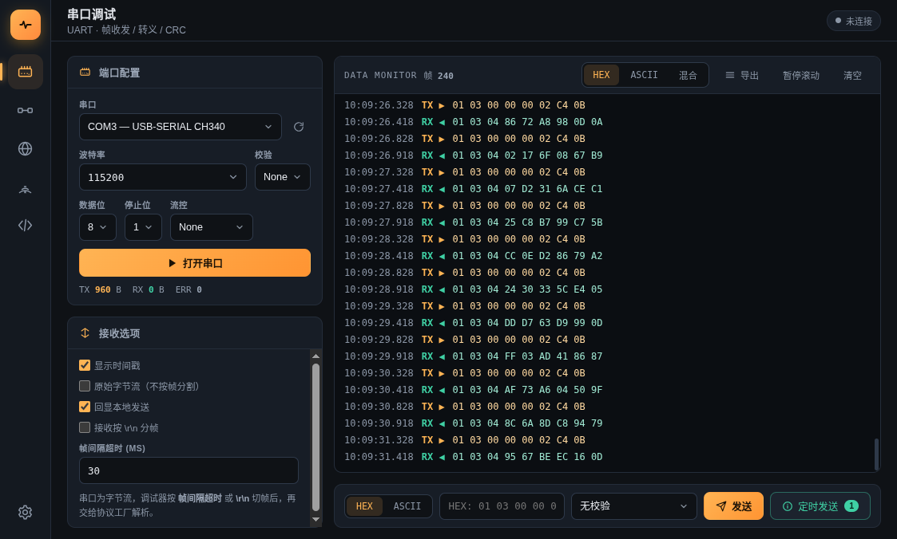 | 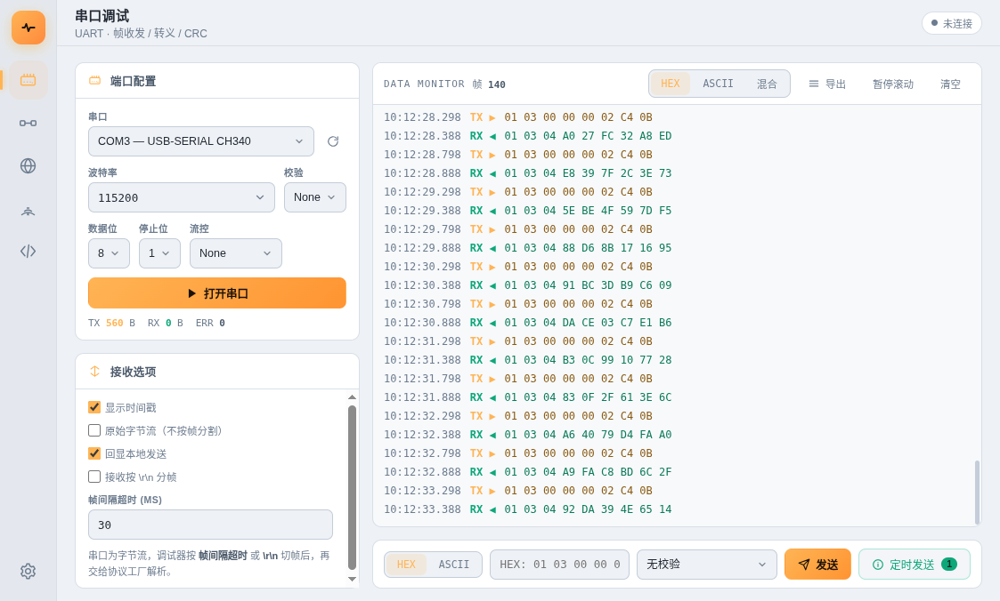 |

### CAN bus — dark / light

| Dark | Light |
|---|---|
| 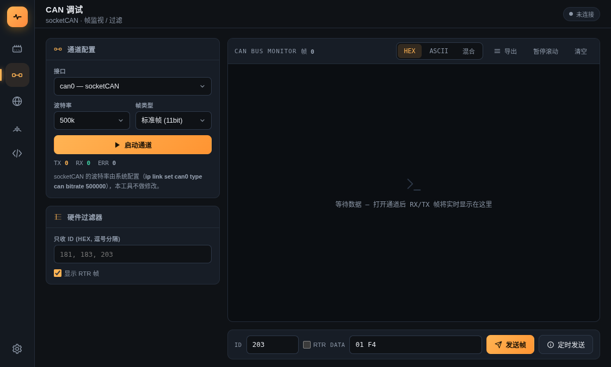 | 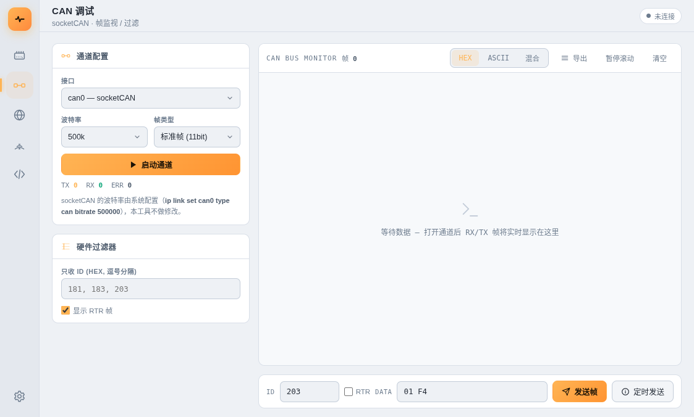 |

### TCP / UDP — dark / light

| Dark | Light |
|---|---|
| 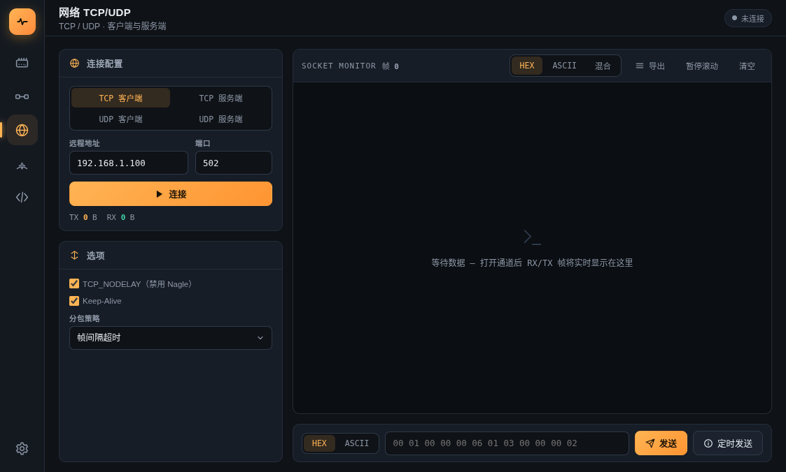 | 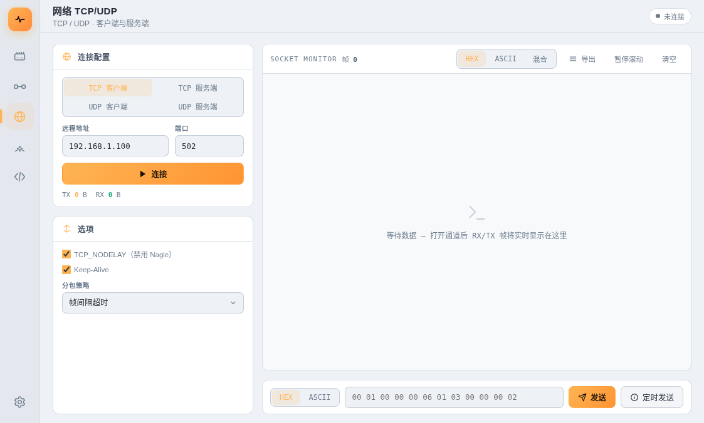 |

### MQTT — dark / light

| Dark | Light |
|---|---|
| 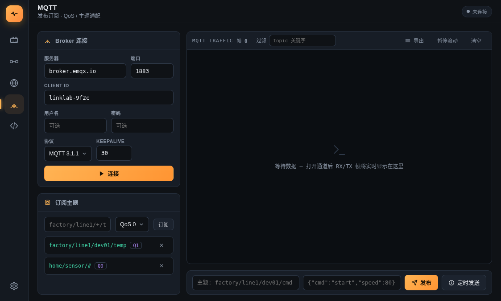 |  |

### Protocol factory — dark / light

| Dark | Light |
|---|---|
| 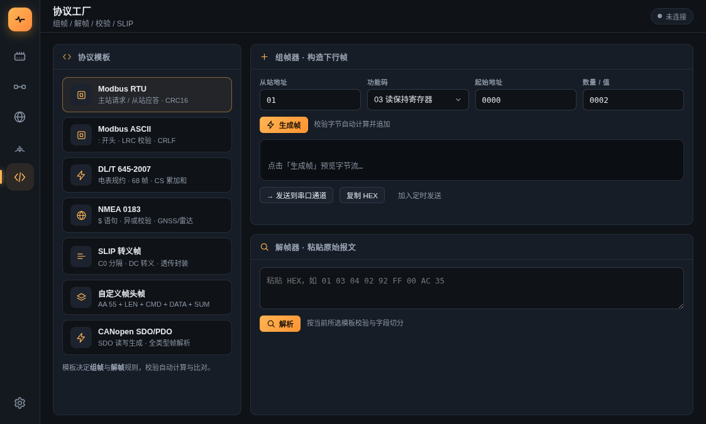 | 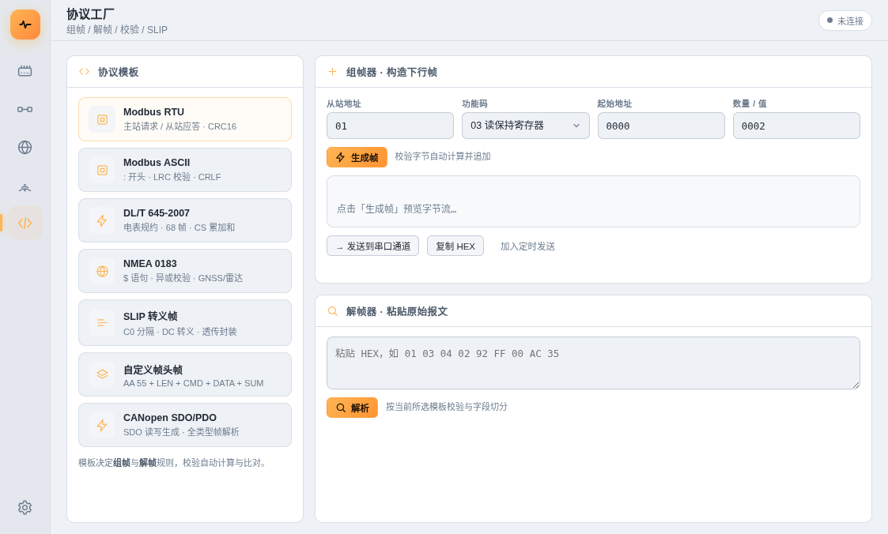 |

### Settings (light) & English UI

| Settings (light) | English UI (dark) |
|---|---|
| 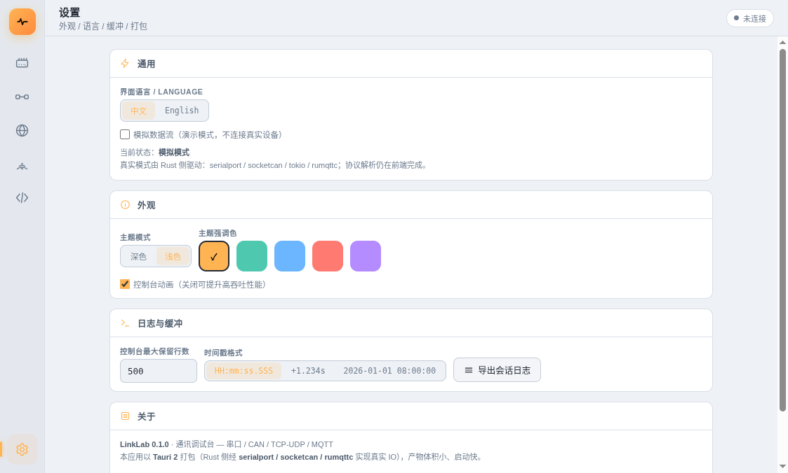 |  |

## Architecture

```
┌─ Frontend React 18 + TS ────────┐  IPC (20ms batch)  ┌─ Backend Tauri 2 / Rust ┐
│ 6 pages · consoles · proto lab  │ ←─────────────────→ │ serialport   serial      │
│ store · i18n · theming          │  frame-batch event  │ tokio        TCP/UDP     │
│ protocol algorithms (CRC/…)     │  invoke commands    │ rumqttc      MQTT        │
│ mock engine (auto fallback)     │                     │ socketcan    CAN (Linux) │
└─────────────────────────────────┘                     └──────────────────────────┘
```

- The backend only moves bytes and **splits frames** (gap / CRLF / fixed-length / MBAP); protocol parsing stays in the frontend as a single implementation.
- **Dual mode**: real IO when packaged; the browser preview (`pnpm dev`) automatically falls back to a mock engine. Mock can also be forced in Settings.
- **High performance**: 20 ms batched IPC + batched rendering + DOM windowing keeps the UI responsive at ~10 k frames/s, with an auto-pause guard against data floods.
- Config and queues persist locally (localStorage) and restore on restart.

## Development

```bash
pnpm install
pnpm dev          # browser preview (mock mode)
pnpm app:dev      # Tauri desktop dev (real IO, Rust toolchain required)
```

## Packaging & Release

```bash
pnpm app:build    # local build, output in src-tauri/target/release/bundle
```

| Platform | Artifacts |
|---|---|
| Linux | `.deb` · `.AppImage` |
| Windows | `.exe` (NSIS installer) · `.msi` |
| macOS | `.dmg` (universal: Apple Silicon + Intel) |

**CI**: pushing a `v*` tag builds all three platforms and publishes a GitHub Release:

```bash
git tag v0.1.0 && git push origin v0.1.0
```

See [.github/workflows/build.yml](.github/workflows/build.yml).

---

# 中文 · LinkLab 通讯调试台

**LinkLab** 是一款面向嵌入式开发与联调的跨平台通讯调试工具，覆盖 **串口 UART / CAN 总线 / TCP-UDP 网络 / MQTT** 四类常用链路，内置协议工厂（Modbus、CANopen、DL/T 645、NMEA 等）与定时发送队列。

由单文件 HTML 原型重写为 **React 18 + TypeScript + Tauri 2（Rust）** 桌面应用，安装包体积小、启动快、内存占用低。支持**深色 / 浅色双主题**与**中英双语**界面。

## 功能总览

| 通道 | 能力 |
|---|---|
| **串口 UART** | 任意波特率（1200 ~ 2000000）+ 17 个常用预设、USB 设备热插拔自动枚举、数据/停止/校验/流控全配置、帧间隔 / `\r\n` / 原始字节流切帧 |
| **CAN 总线** | socketCAN（can0 / vcan0 动态检测）、标准帧 / 扩展帧、RTR 远程帧、硬件过滤（ID + 掩码）、CANopen 帧解析 |
| **网络 TCP/UDP** | TCP 客户端 / TCP 服务端（多客户端）、UDP 客户端 / UDP 服务端，服务端自动回复最近对端 |
| **MQTT** | 发布 / 订阅、主题过滤、QoS、JSON 数据流演示 |

**协议工厂**（组帧 + 解帧双向、真实校验算法）：
- Modbus RTU（CRC16）· Modbus ASCII（LRC）· Modbus TCP（MBAP）
- CANopen（NMT / SDO / PDO / EMCY / 心跳 逐字段解析，SDO 读写帧生成）
- DL/T 645-2007（电表规约，CS 校验）· NMEA 0183（异或校验）
- SLIP 转义 · 自定义帧头帧（SUM 校验）

**效率工具**：
- 定时发送队列：每通道独立任务，启停 / 倒计时 / 循环发射
- 右键任意数据行 → 选协议 → 弹窗逐字段解析（含校验失败定位）
- CRC 工具：SUM-8 / CRC-8 / CRC16-Modbus / CRC16-CCITT，发送前自动附加
- 数据导出：系统"另存为"对话框，时间戳 + HEX + ASCII 四列格式，四控制台会话合并导出
- 深色 / 浅色主题 + 5 色强调色 + 中英双语，全部持久化

## 界面一览

### 串口调试 — 深色 / 浅色
端口热插拔枚举、完整串口参数、HEX/ASCII 收发、帧间隔切帧。

| 深色 | 浅色 |
|---|---|
|  |  |

### CAN 调试 — 深色 / 浅色
socketCAN 接口自动检测、ID 过滤、CANopen SDO/PDO 解析、单帧发送与定时发射。

| 深色 | 浅色 |
|---|---|
|  |  |

### 网络 TCP/UDP — 深色 / 浅色
四种模式（TCP 客户端/服务端、UDP 客户端/服务端）自适应表单，多客户端管理。

| 深色 | 浅色 |
|---|---|
|  |  |

### MQTT — 深色 / 浅色
Broker 连接、发布/订阅、主题过滤视图。

| 深色 | 浅色 |
|---|---|
|  |  |

### 协议工厂 — 深色 / 浅色
7 种协议模板的组帧 / 解帧器：字节级标注、校验计算、一键发送到对应通道。

| 深色 | 浅色 |
|---|---|
|  |  |

### 设置（浅色）与英文界面

| 设置（浅色） | 英文界面（深色） |
|---|---|
|  |  |

## 架构

```
┌─ 前端 React 18 + TS ────────────┐   IPC(20ms 批量)   ┌─ 后端 Tauri 2 / Rust ──┐
│ 6 页 UI · 控制台 · 协议工厂      │ ←────────────────→ │ serialport   串口       │
│ 自研 store · i18n · 主题        │   frame-batch 事件  │ tokio        TCP/UDP    │
│ 协议算法（CRC/SLIP/Modbus…）    │   invoke 命令       │ rumqttc      MQTT       │
│ 模拟引擎（无后端时自动降级）      │                    │ socketcan    CAN(Linux) │
└────────────────────────────────┘                    └────────────────────────┘
```

- **后端只做字节搬运与切帧**（帧间隔 / CRLF / 定长 / MBAP），协议解析保留在前端，保持单一实现
- **双模式**：打包后走真实 IO；浏览器 `pnpm dev` 打开时自动降级为模拟引擎（演示数据流），也可在设置页强制模拟
- **高性能**：Rust 侧 20ms 批量发帧 + 前端批量渲染 + DOM 窗口化，万帧/秒不卡 UI；超大数据流自动暂停保护
- 配置与队列持久化于本机（localStorage），重启自动恢复

## 开发

```bash
pnpm install
pnpm dev          # 浏览器预览（自动模拟模式）
pnpm app:dev      # Tauri 桌面开发（真实 IO，需 Rust 工具链）
```

> Linux 构建依赖：libwebkit2gtk-4.1-dev、libudev-dev 等，详见 [tauri 官方文档](https://tauri.app/start/prerequisites/)。

## 打包与发布

```bash
pnpm app:build    # 本机打包，产物在 src-tauri/target/release/bundle
```

| 平台 | 产物 |
|---|---|
| Linux | `.deb` · `.AppImage` |
| Windows | `.exe`（NSIS 安装器）· `.msi` |
| macOS | `.dmg`（universal：Apple Silicon + Intel） |

**CI 自动发布**：推送 `v*` 标签即触发三平台构建并发布 GitHub Release：

```bash
git tag v0.1.0 && git push origin v0.1.0
```

工作流见 [.github/workflows/build.yml](.github/workflows/build.yml)（官方 tauri-action + Rust 缓存，手动触发时发草稿 Release）。

## 项目结构

```
linklab/
├── src/                    # 前端（React + TS）
│   ├── lib/                # store / 协议算法 / 桥接 / 模拟引擎 / i18n
│   ├── components/         # 控制台 / 导航 / 定时发送 / 图标
│   ├── pages/              # 串口 / CAN / 网络 / MQTT / 协议工厂 / 设置
│   └── styles/             # 主题（深/浅 + 强调色）
├── src-tauri/              # Rust 后端
│   ├── src/                # serial / net / mqtt / can / framer / state
│   ├── capabilities/       # Tauri 权限
│   └── icons/              # 全套应用图标
├── docs/screenshots/       # 界面截图（深色 / 浅色 / 英文）
└── .github/workflows/      # 三平台 CI/CD
```
